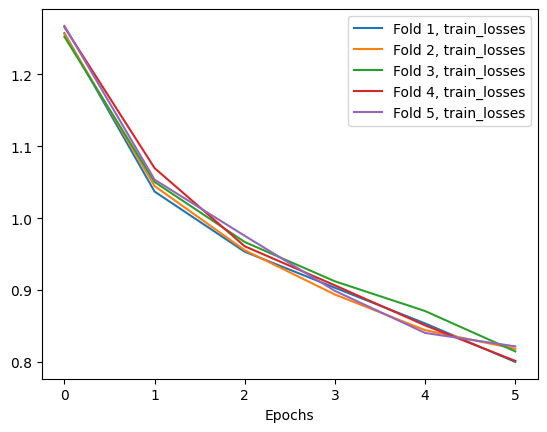
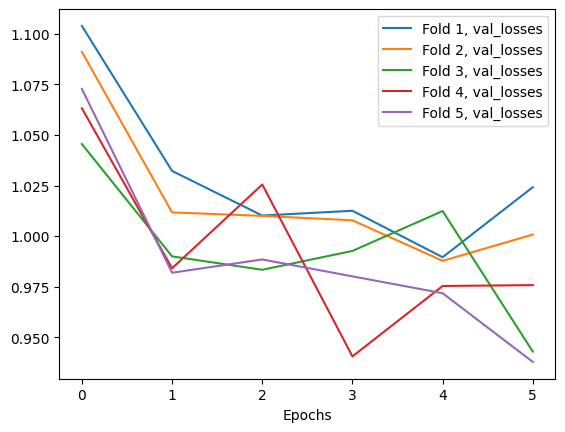
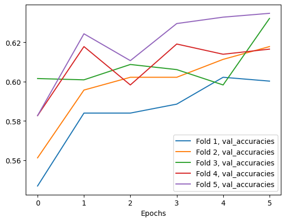

## 2.4 Transfer Learning

### Setup and Data Loading

As before, we'll import the packages we'll need in this notebook. Most of these are the same as the previous notebook, but there are a few new ones.


```python
import os

import matplotlib
import matplotlib.pyplot as plt
import numpy as np
import sklearn.model_selection
import torch
import torch.nn as nn
import torch.optim as optim
import torchinfo
import torchvision
from sklearn.metrics import ConfusionMatrixDisplay, confusion_matrix
from torch.utils.data import DataLoader
from torchinfo import summary
from torchvision import datasets, transforms
from tqdm import tqdm
```

Let's print out the versions of our packages again. If we come back to this later, we'll know what we used.


```python
print("torch version : ", torch.__version__)
print("torchvision version : ", torchvision.__version__)
print("torchinfo version : ", torchinfo.__version__)
print("numpy version : ", np.__version__)
print("matplotlib version : ", matplotlib.__version__)

!python --version
```

    torch version :  2.2.2+cu121
    torchvision version :  0.17.2+cu121
    torchinfo version :  1.8.0
    numpy version :  1.26.3
    matplotlib version :  3.9.2
    Python 3.11.0


We should be running on GPUs, so the device should be `cuda`.


```python
if torch.cuda.is_available():
    device = "cuda"
elif torch.backends.mps.is_available():
    device = "mps"
else:
    device = "cpu"

print(f"Using {device} device.")
```

    Using cuda device.


### Loading Data

We'll be working with the same undersampled dataset we created in an earlier lesson, in the `data_p2/data_undersampled/train` directory. We'll also be applying the same transformations. Let's load it.

**Task 2.4.1:** Create the `data_dir` variable for the undersampled training data.


```python
data_dir = os.path.join("data_p2", "data_undersampled", "train")

print("Data directory:", data_dir)
```

    Data directory: data_p2/data_undersampled/train


We'll be applying the same transformations we have been all along:

- Convert grayscale images to RGB
- Resize images to $224$ x $224$
- Convert images to PyTorch tensors
- Normalize the tensors

Here's the function we've been using to convert to RGB.


```python
class ConvertToRGB(object):
    def __call__(self, img):
        if img.mode != "RGB":
            img = img.convert("RGB")
        return img
```

**Task 2.4.2:** Create the set of transformations listed above. Use the means and standard deviations from the `022-explore-dataset` lesson.


```python
transform_normalized = transforms.Compose(
    [
    ConvertToRGB(),
    transforms.Resize((224, 224)),
    transforms.ToTensor(),
    transforms.Normalize(
        mean=(0.4326, 0.4952, 0.3120), 
        std=(0.2179, 0.2214, 0.2091)
    )
    ]
)
transform_normalized
```


    Compose(
        <__main__.ConvertToRGB object at 0x73e78639f7d0>
        Resize(size=(224, 224), interpolation=bilinear, max_size=None, antialias=True)
        ToTensor()
        Normalize(mean=(0.4326, 0.4952, 0.312), std=(0.2179, 0.2214, 0.2091))
    )


**Task 2.4.3:** Use `ImageFolder` to read the files in our `data_dir` and apply our transformations.


```python
dataset = datasets.ImageFolder(data_dir, transform_normalized)

dataset
```


    Dataset ImageFolder
        Number of datapoints: 7615
        Root location: data_p2/data_undersampled/train
        StandardTransform
    Transform: Compose(
                   <__main__.ConvertToRGB object at 0x73e78639f7d0>
                   Resize(size=(224, 224), interpolation=bilinear, max_size=None, antialias=True)
                   ToTensor()
                   Normalize(mean=(0.4326, 0.4952, 0.312), std=(0.2179, 0.2214, 0.2091))
               )


As a double check, we should have the same $5$ classes as before, with Cassava plants.


```python
classes = dataset.classes
classes
```


    ['cassava-bacterial-blight-cbb',
     'cassava-brown-streak-disease-cbsd',
     'cassava-green-mottle-cgm',
     'cassava-healthy',
     'cassava-mosaic-disease-cmd']


We should be using the undersampled data. Let's also make sure that the classes are balanced. We can use the `class_counts` function we've used in previous lessons.


```python
from training import class_counts
```

**Task 2.4.4:** Use the `class_counts` function on our dataset to verify all classes have the same number of observations.


```python
counts = class_counts(dataset)
counts
```


      0%|          | 0/7615 [00:00<?, ?it/s]


    cassava-bacterial-blight-cbb         1523
    cassava-brown-streak-disease-cbsd    1523
    cassava-green-mottle-cgm             1523
    cassava-healthy                      1523
    cassava-mosaic-disease-cmd           1523
    dtype: int64


As you'll see later, we'll be handling training and validation differently in this notebook. For now, we'll use the full dataset. Let's make a `DataLoader` for the dataset.

**Task 2.4.5:** Create a `DataLoader` for the dataset. Use a batch size of $32$.


```python
batch_size = 32
dataset_loader = DataLoader(dataset, batch_size=batch_size)

print(f"Batch shape: {next(iter(dataset_loader))[0].shape}")
```

    Batch shape: torch.Size([32, 3, 224, 224])


### Implementing Transfer Learning

We have our data, now we need a model. In the last lesson and the previous project, we built our own. But classifying images is a very common task, many people have already done it. Those people have already spent the time and computing resources to design and train a model. If we can get their architecture and weights, we can use theirs!

Thankfully, many models like this are publicly available. These are called _pre-trained models_. PyTorch comes with some included. Here we'll load a model called `resnet`.


```python
model = torchvision.models.resnet50(weights=torchvision.models.ResNet50_Weights.DEFAULT)
```

This model is very large, and took a long time to train. Let's look at the model summary to see what we're working with. To get a full summary, we'll need to provide the model with the shape of our data.

**Task 2.4.6:** Get the shape of the `test_batch` of data, and use that as the `input_size` when you call `summary` on the model.


```python
test_batch = next(iter(dataset_loader))[0]
batch_shape = test_batch.shape

# Create the model summary
summary(model, input_size=batch_shape)
```


    ==========================================================================================
    Layer (type:depth-idx)                   Output Shape              Param #
    ==========================================================================================
    ResNet                                   [32, 1000]                --
    ├─Conv2d: 1-1                            [32, 64, 112, 112]        9,408
    ├─BatchNorm2d: 1-2                       [32, 64, 112, 112]        128
    ├─ReLU: 1-3                              [32, 64, 112, 112]        --
    ├─MaxPool2d: 1-4                         [32, 64, 56, 56]          --
    ├─Sequential: 1-5                        [32, 256, 56, 56]         --
    │    └─Bottleneck: 2-1                   [32, 256, 56, 56]         --
    │    │    └─Conv2d: 3-1                  [32, 64, 56, 56]          4,096
    │    │    └─BatchNorm2d: 3-2             [32, 64, 56, 56]          128
    │    │    └─ReLU: 3-3                    [32, 64, 56, 56]          --
    │    │    └─Conv2d: 3-4                  [32, 64, 56, 56]          36,864
    │    │    └─BatchNorm2d: 3-5             [32, 64, 56, 56]          128
    │    │    └─ReLU: 3-6                    [32, 64, 56, 56]          --
    │    │    └─Conv2d: 3-7                  [32, 256, 56, 56]         16,384
    │    │    └─BatchNorm2d: 3-8             [32, 256, 56, 56]         512
    │    │    └─Sequential: 3-9              [32, 256, 56, 56]         16,896
    │    │    └─ReLU: 3-10                   [32, 256, 56, 56]         --
    │    └─Bottleneck: 2-2                   [32, 256, 56, 56]         --
    │    │    └─Conv2d: 3-11                 [32, 64, 56, 56]          16,384
    │    │    └─BatchNorm2d: 3-12            [32, 64, 56, 56]          128
    │    │    └─ReLU: 3-13                   [32, 64, 56, 56]          --
    │    │    └─Conv2d: 3-14                 [32, 64, 56, 56]          36,864
    │    │    └─BatchNorm2d: 3-15            [32, 64, 56, 56]          128
    │    │    └─ReLU: 3-16                   [32, 64, 56, 56]          --
    │    │    └─Conv2d: 3-17                 [32, 256, 56, 56]         16,384
    │    │    └─BatchNorm2d: 3-18            [32, 256, 56, 56]         512
    │    │    └─ReLU: 3-19                   [32, 256, 56, 56]         --
    │    └─Bottleneck: 2-3                   [32, 256, 56, 56]         --
    │    │    └─Conv2d: 3-20                 [32, 64, 56, 56]          16,384
    │    │    └─BatchNorm2d: 3-21            [32, 64, 56, 56]          128
    │    │    └─ReLU: 3-22                   [32, 64, 56, 56]          --
    │    │    └─Conv2d: 3-23                 [32, 64, 56, 56]          36,864
    │    │    └─BatchNorm2d: 3-24            [32, 64, 56, 56]          128
    │    │    └─ReLU: 3-25                   [32, 64, 56, 56]          --
    │    │    └─Conv2d: 3-26                 [32, 256, 56, 56]         16,384
    │    │    └─BatchNorm2d: 3-27            [32, 256, 56, 56]         512
    │    │    └─ReLU: 3-28                   [32, 256, 56, 56]         --
    ├─Sequential: 1-6                        [32, 512, 28, 28]         --
    │    └─Bottleneck: 2-4                   [32, 512, 28, 28]         --
    │    │    └─Conv2d: 3-29                 [32, 128, 56, 56]         32,768
    │    │    └─BatchNorm2d: 3-30            [32, 128, 56, 56]         256
    │    │    └─ReLU: 3-31                   [32, 128, 56, 56]         --
    │    │    └─Conv2d: 3-32                 [32, 128, 28, 28]         147,456
    │    │    └─BatchNorm2d: 3-33            [32, 128, 28, 28]         256
    │    │    └─ReLU: 3-34                   [32, 128, 28, 28]         --
    │    │    └─Conv2d: 3-35                 [32, 512, 28, 28]         65,536
    │    │    └─BatchNorm2d: 3-36            [32, 512, 28, 28]         1,024
    │    │    └─Sequential: 3-37             [32, 512, 28, 28]         132,096
    │    │    └─ReLU: 3-38                   [32, 512, 28, 28]         --
    │    └─Bottleneck: 2-5                   [32, 512, 28, 28]         --
    │    │    └─Conv2d: 3-39                 [32, 128, 28, 28]         65,536
    │    │    └─BatchNorm2d: 3-40            [32, 128, 28, 28]         256
    │    │    └─ReLU: 3-41                   [32, 128, 28, 28]         --
    │    │    └─Conv2d: 3-42                 [32, 128, 28, 28]         147,456
    │    │    └─BatchNorm2d: 3-43            [32, 128, 28, 28]         256
    │    │    └─ReLU: 3-44                   [32, 128, 28, 28]         --
    │    │    └─Conv2d: 3-45                 [32, 512, 28, 28]         65,536
    │    │    └─BatchNorm2d: 3-46            [32, 512, 28, 28]         1,024
    │    │    └─ReLU: 3-47                   [32, 512, 28, 28]         --
    │    └─Bottleneck: 2-6                   [32, 512, 28, 28]         --
    │    │    └─Conv2d: 3-48                 [32, 128, 28, 28]         65,536
    │    │    └─BatchNorm2d: 3-49            [32, 128, 28, 28]         256
    │    │    └─ReLU: 3-50                   [32, 128, 28, 28]         --
    │    │    └─Conv2d: 3-51                 [32, 128, 28, 28]         147,456
    │    │    └─BatchNorm2d: 3-52            [32, 128, 28, 28]         256
    │    │    └─ReLU: 3-53                   [32, 128, 28, 28]         --
    │    │    └─Conv2d: 3-54                 [32, 512, 28, 28]         65,536
    │    │    └─BatchNorm2d: 3-55            [32, 512, 28, 28]         1,024
    │    │    └─ReLU: 3-56                   [32, 512, 28, 28]         --
    │    └─Bottleneck: 2-7                   [32, 512, 28, 28]         --
    │    │    └─Conv2d: 3-57                 [32, 128, 28, 28]         65,536
    │    │    └─BatchNorm2d: 3-58            [32, 128, 28, 28]         256
    │    │    └─ReLU: 3-59                   [32, 128, 28, 28]         --
    │    │    └─Conv2d: 3-60                 [32, 128, 28, 28]         147,456
    │    │    └─BatchNorm2d: 3-61            [32, 128, 28, 28]         256
    │    │    └─ReLU: 3-62                   [32, 128, 28, 28]         --
    │    │    └─Conv2d: 3-63                 [32, 512, 28, 28]         65,536
    │    │    └─BatchNorm2d: 3-64            [32, 512, 28, 28]         1,024
    │    │    └─ReLU: 3-65                   [32, 512, 28, 28]         --
    ├─Sequential: 1-7                        [32, 1024, 14, 14]        --
    │    └─Bottleneck: 2-8                   [32, 1024, 14, 14]        --
    │    │    └─Conv2d: 3-66                 [32, 256, 28, 28]         131,072
    │    │    └─BatchNorm2d: 3-67            [32, 256, 28, 28]         512
    │    │    └─ReLU: 3-68                   [32, 256, 28, 28]         --
    │    │    └─Conv2d: 3-69                 [32, 256, 14, 14]         589,824
    │    │    └─BatchNorm2d: 3-70            [32, 256, 14, 14]         512
    │    │    └─ReLU: 3-71                   [32, 256, 14, 14]         --
    │    │    └─Conv2d: 3-72                 [32, 1024, 14, 14]        262,144
    │    │    └─BatchNorm2d: 3-73            [32, 1024, 14, 14]        2,048
    │    │    └─Sequential: 3-74             [32, 1024, 14, 14]        526,336
    │    │    └─ReLU: 3-75                   [32, 1024, 14, 14]        --
    │    └─Bottleneck: 2-9                   [32, 1024, 14, 14]        --
    │    │    └─Conv2d: 3-76                 [32, 256, 14, 14]         262,144
    │    │    └─BatchNorm2d: 3-77            [32, 256, 14, 14]         512
    │    │    └─ReLU: 3-78                   [32, 256, 14, 14]         --
    │    │    └─Conv2d: 3-79                 [32, 256, 14, 14]         589,824
    │    │    └─BatchNorm2d: 3-80            [32, 256, 14, 14]         512
    │    │    └─ReLU: 3-81                   [32, 256, 14, 14]         --
    │    │    └─Conv2d: 3-82                 [32, 1024, 14, 14]        262,144
    │    │    └─BatchNorm2d: 3-83            [32, 1024, 14, 14]        2,048
    │    │    └─ReLU: 3-84                   [32, 1024, 14, 14]        --
    │    └─Bottleneck: 2-10                  [32, 1024, 14, 14]        --
    │    │    └─Conv2d: 3-85                 [32, 256, 14, 14]         262,144
    │    │    └─BatchNorm2d: 3-86            [32, 256, 14, 14]         512
    │    │    └─ReLU: 3-87                   [32, 256, 14, 14]         --
    │    │    └─Conv2d: 3-88                 [32, 256, 14, 14]         589,824
    │    │    └─BatchNorm2d: 3-89            [32, 256, 14, 14]         512
    │    │    └─ReLU: 3-90                   [32, 256, 14, 14]         --
    │    │    └─Conv2d: 3-91                 [32, 1024, 14, 14]        262,144
    │    │    └─BatchNorm2d: 3-92            [32, 1024, 14, 14]        2,048
    │    │    └─ReLU: 3-93                   [32, 1024, 14, 14]        --
    │    └─Bottleneck: 2-11                  [32, 1024, 14, 14]        --
    │    │    └─Conv2d: 3-94                 [32, 256, 14, 14]         262,144
    │    │    └─BatchNorm2d: 3-95            [32, 256, 14, 14]         512
    │    │    └─ReLU: 3-96                   [32, 256, 14, 14]         --
    │    │    └─Conv2d: 3-97                 [32, 256, 14, 14]         589,824
    │    │    └─BatchNorm2d: 3-98            [32, 256, 14, 14]         512
    │    │    └─ReLU: 3-99                   [32, 256, 14, 14]         --
    │    │    └─Conv2d: 3-100                [32, 1024, 14, 14]        262,144
    │    │    └─BatchNorm2d: 3-101           [32, 1024, 14, 14]        2,048
    │    │    └─ReLU: 3-102                  [32, 1024, 14, 14]        --
    │    └─Bottleneck: 2-12                  [32, 1024, 14, 14]        --
    │    │    └─Conv2d: 3-103                [32, 256, 14, 14]         262,144
    │    │    └─BatchNorm2d: 3-104           [32, 256, 14, 14]         512
    │    │    └─ReLU: 3-105                  [32, 256, 14, 14]         --
    │    │    └─Conv2d: 3-106                [32, 256, 14, 14]         589,824
    │    │    └─BatchNorm2d: 3-107           [32, 256, 14, 14]         512
    │    │    └─ReLU: 3-108                  [32, 256, 14, 14]         --
    │    │    └─Conv2d: 3-109                [32, 1024, 14, 14]        262,144
    │    │    └─BatchNorm2d: 3-110           [32, 1024, 14, 14]        2,048
    │    │    └─ReLU: 3-111                  [32, 1024, 14, 14]        --
    │    └─Bottleneck: 2-13                  [32, 1024, 14, 14]        --
    │    │    └─Conv2d: 3-112                [32, 256, 14, 14]         262,144
    │    │    └─BatchNorm2d: 3-113           [32, 256, 14, 14]         512
    │    │    └─ReLU: 3-114                  [32, 256, 14, 14]         --
    │    │    └─Conv2d: 3-115                [32, 256, 14, 14]         589,824
    │    │    └─BatchNorm2d: 3-116           [32, 256, 14, 14]         512
    │    │    └─ReLU: 3-117                  [32, 256, 14, 14]         --
    │    │    └─Conv2d: 3-118                [32, 1024, 14, 14]        262,144
    │    │    └─BatchNorm2d: 3-119           [32, 1024, 14, 14]        2,048
    │    │    └─ReLU: 3-120                  [32, 1024, 14, 14]        --
    ├─Sequential: 1-8                        [32, 2048, 7, 7]          --
    │    └─Bottleneck: 2-14                  [32, 2048, 7, 7]          --
    │    │    └─Conv2d: 3-121                [32, 512, 14, 14]         524,288
    │    │    └─BatchNorm2d: 3-122           [32, 512, 14, 14]         1,024
    │    │    └─ReLU: 3-123                  [32, 512, 14, 14]         --
    │    │    └─Conv2d: 3-124                [32, 512, 7, 7]           2,359,296
    │    │    └─BatchNorm2d: 3-125           [32, 512, 7, 7]           1,024
    │    │    └─ReLU: 3-126                  [32, 512, 7, 7]           --
    │    │    └─Conv2d: 3-127                [32, 2048, 7, 7]          1,048,576
    │    │    └─BatchNorm2d: 3-128           [32, 2048, 7, 7]          4,096
    │    │    └─Sequential: 3-129            [32, 2048, 7, 7]          2,101,248
    │    │    └─ReLU: 3-130                  [32, 2048, 7, 7]          --
    │    └─Bottleneck: 2-15                  [32, 2048, 7, 7]          --
    │    │    └─Conv2d: 3-131                [32, 512, 7, 7]           1,048,576
    │    │    └─BatchNorm2d: 3-132           [32, 512, 7, 7]           1,024
    │    │    └─ReLU: 3-133                  [32, 512, 7, 7]           --
    │    │    └─Conv2d: 3-134                [32, 512, 7, 7]           2,359,296
    │    │    └─BatchNorm2d: 3-135           [32, 512, 7, 7]           1,024
    │    │    └─ReLU: 3-136                  [32, 512, 7, 7]           --
    │    │    └─Conv2d: 3-137                [32, 2048, 7, 7]          1,048,576
    │    │    └─BatchNorm2d: 3-138           [32, 2048, 7, 7]          4,096
    │    │    └─ReLU: 3-139                  [32, 2048, 7, 7]          --
    │    └─Bottleneck: 2-16                  [32, 2048, 7, 7]          --
    │    │    └─Conv2d: 3-140                [32, 512, 7, 7]           1,048,576
    │    │    └─BatchNorm2d: 3-141           [32, 512, 7, 7]           1,024
    │    │    └─ReLU: 3-142                  [32, 512, 7, 7]           --
    │    │    └─Conv2d: 3-143                [32, 512, 7, 7]           2,359,296
    │    │    └─BatchNorm2d: 3-144           [32, 512, 7, 7]           1,024
    │    │    └─ReLU: 3-145                  [32, 512, 7, 7]           --
    │    │    └─Conv2d: 3-146                [32, 2048, 7, 7]          1,048,576
    │    │    └─BatchNorm2d: 3-147           [32, 2048, 7, 7]          4,096
    │    │    └─ReLU: 3-148                  [32, 2048, 7, 7]          --
    ├─AdaptiveAvgPool2d: 1-9                 [32, 2048, 1, 1]          --
    ├─Linear: 1-10                           [32, 1000]                2,049,000
    ==========================================================================================
    Total params: 25,557,032
    Trainable params: 25,557,032
    Non-trainable params: 0
    Total mult-adds (Units.GIGABYTES): 130.86
    ==========================================================================================
    Input size (MB): 19.27
    Forward/backward pass size (MB): 5690.62
    Params size (MB): 102.23
    Estimated Total Size (MB): 5812.11
    ==========================================================================================


<div class="alert alert-info" role="alert">
You may notice that this model has about 25 million parameters. This is quite similar to the model we made in the previous lesson. You'd expect it to have more, since it has so many layers. 
<br><br>
In our last lesson, almost all of the parameters were in the first linear layer. But this model is organized differently, so the parameters are more spread out. Even with about the same number of parameters, this model will be <i>tremendously</i> slower to train, as the structure is more complex and the layers are more computationally expensive. Good thing we don't have to train it!
</div>

This model has _many_ layers! We don't need to worry about the details, since we won't be building or training it. In fact, we need to mark the layers to tell them _not_ to train.

All models come with a `parameters` method that gives us access to the model's weights. We can loop through this to set `requires_grad = False` on all of the weights. This tells the system not to take their derivatives, so backpropagation doesn't update them.


```python
for params in model.parameters():
    params.requires_grad = False
```


```python
next(model.parameters()).shape
```


    torch.Size([64, 3, 7, 7])


This model was trained for a different purpose than we need it for. We can see this by looking at the shape of the output. But our model is very large, so before we run it we'll want to make sure both the model and the `test_batch` are on the GPU.

**Task 2.4.7:** Move the model and the `test_batch` to our `device`.


```python
device
```


    'cuda'


```python
# Move the model to device
model.to(device)

# Move our test_batch to device
test_batch_cuda = test_batch.to(device)

print("Test batch is running on:", test_batch_cuda.device)
```

    Test batch is running on: cuda:0


Now we should be able to check.

**Task 2.4.8:** Run the model on the test batch, and check the shape of the output.


```python
model_test_out = model(test_batch_cuda)
model_test_shape = model_test_out.shape

print("Output shape:", model_test_shape)
```

    Output shape: torch.Size([32, 1000])


### Modifying the Network to Our Task

This model was meant for a task with $1000$ classes. We only have $5$, so that's not going to work for us. Even if they were the same number of classes, it wouldn't work, since it was trained for a different task.

But we can replace the final layer with our own network. The rest of the network will still do the image processing, and provide our layer with good inputs. Our network will do the final classification. This process of using most of an already trained model is called _transfer learning_.

Which layer is the last one? We can access the list of layers with the `named_modules` method. It returns a generator, which we can convert to a list to get the last element.


```python
list(model.named_modules())[-1]
```


    ('fc', Linear(in_features=2048, out_features=1000, bias=True))


This looks right — it's a linear layer with $1000$ neurons (and hence outputs). The thing we really wanted to know was its name — `fc`. Now we can access it with `model.fc`. We'll need to know how many inputs it takes to be able to replace it. It's a `Linear` layer, so the number of inputs it takes is recorded in the `in_features` attribute.

**Task 2.4.9:**: Get the number of input features into the last layer by using `in_features` attribute. Save that to the `in_features` variable.


```python
model
```


    ResNet(
      (conv1): Conv2d(3, 64, kernel_size=(7, 7), stride=(2, 2), padding=(3, 3), bias=False)
      (bn1): BatchNorm2d(64, eps=1e-05, momentum=0.1, affine=True, track_running_stats=True)
      (relu): ReLU(inplace=True)
      (maxpool): MaxPool2d(kernel_size=3, stride=2, padding=1, dilation=1, ceil_mode=False)
      (layer1): Sequential(
        (0): Bottleneck(
          (conv1): Conv2d(64, 64, kernel_size=(1, 1), stride=(1, 1), bias=False)
          (bn1): BatchNorm2d(64, eps=1e-05, momentum=0.1, affine=True, track_running_stats=True)
          (conv2): Conv2d(64, 64, kernel_size=(3, 3), stride=(1, 1), padding=(1, 1), bias=False)
          (bn2): BatchNorm2d(64, eps=1e-05, momentum=0.1, affine=True, track_running_stats=True)
          (conv3): Conv2d(64, 256, kernel_size=(1, 1), stride=(1, 1), bias=False)
          (bn3): BatchNorm2d(256, eps=1e-05, momentum=0.1, affine=True, track_running_stats=True)
          (relu): ReLU(inplace=True)
          (downsample): Sequential(
            (0): Conv2d(64, 256, kernel_size=(1, 1), stride=(1, 1), bias=False)
            (1): BatchNorm2d(256, eps=1e-05, momentum=0.1, affine=True, track_running_stats=True)
          )
        )
        (1): Bottleneck(
          (conv1): Conv2d(256, 64, kernel_size=(1, 1), stride=(1, 1), bias=False)
          (bn1): BatchNorm2d(64, eps=1e-05, momentum=0.1, affine=True, track_running_stats=True)
          (conv2): Conv2d(64, 64, kernel_size=(3, 3), stride=(1, 1), padding=(1, 1), bias=False)
          (bn2): BatchNorm2d(64, eps=1e-05, momentum=0.1, affine=True, track_running_stats=True)
          (conv3): Conv2d(64, 256, kernel_size=(1, 1), stride=(1, 1), bias=False)
          (bn3): BatchNorm2d(256, eps=1e-05, momentum=0.1, affine=True, track_running_stats=True)
          (relu): ReLU(inplace=True)
        )
        (2): Bottleneck(
          (conv1): Conv2d(256, 64, kernel_size=(1, 1), stride=(1, 1), bias=False)
          (bn1): BatchNorm2d(64, eps=1e-05, momentum=0.1, affine=True, track_running_stats=True)
          (conv2): Conv2d(64, 64, kernel_size=(3, 3), stride=(1, 1), padding=(1, 1), bias=False)
          (bn2): BatchNorm2d(64, eps=1e-05, momentum=0.1, affine=True, track_running_stats=True)
          (conv3): Conv2d(64, 256, kernel_size=(1, 1), stride=(1, 1), bias=False)
          (bn3): BatchNorm2d(256, eps=1e-05, momentum=0.1, affine=True, track_running_stats=True)
          (relu): ReLU(inplace=True)
        )
      )
      (layer2): Sequential(
        (0): Bottleneck(
          (conv1): Conv2d(256, 128, kernel_size=(1, 1), stride=(1, 1), bias=False)
          (bn1): BatchNorm2d(128, eps=1e-05, momentum=0.1, affine=True, track_running_stats=True)
          (conv2): Conv2d(128, 128, kernel_size=(3, 3), stride=(2, 2), padding=(1, 1), bias=False)
          (bn2): BatchNorm2d(128, eps=1e-05, momentum=0.1, affine=True, track_running_stats=True)
          (conv3): Conv2d(128, 512, kernel_size=(1, 1), stride=(1, 1), bias=False)
          (bn3): BatchNorm2d(512, eps=1e-05, momentum=0.1, affine=True, track_running_stats=True)
          (relu): ReLU(inplace=True)
          (downsample): Sequential(
            (0): Conv2d(256, 512, kernel_size=(1, 1), stride=(2, 2), bias=False)
            (1): BatchNorm2d(512, eps=1e-05, momentum=0.1, affine=True, track_running_stats=True)
          )
        )
        (1): Bottleneck(
          (conv1): Conv2d(512, 128, kernel_size=(1, 1), stride=(1, 1), bias=False)
          (bn1): BatchNorm2d(128, eps=1e-05, momentum=0.1, affine=True, track_running_stats=True)
          (conv2): Conv2d(128, 128, kernel_size=(3, 3), stride=(1, 1), padding=(1, 1), bias=False)
          (bn2): BatchNorm2d(128, eps=1e-05, momentum=0.1, affine=True, track_running_stats=True)
          (conv3): Conv2d(128, 512, kernel_size=(1, 1), stride=(1, 1), bias=False)
          (bn3): BatchNorm2d(512, eps=1e-05, momentum=0.1, affine=True, track_running_stats=True)
          (relu): ReLU(inplace=True)
        )
        (2): Bottleneck(
          (conv1): Conv2d(512, 128, kernel_size=(1, 1), stride=(1, 1), bias=False)
          (bn1): BatchNorm2d(128, eps=1e-05, momentum=0.1, affine=True, track_running_stats=True)
          (conv2): Conv2d(128, 128, kernel_size=(3, 3), stride=(1, 1), padding=(1, 1), bias=False)
          (bn2): BatchNorm2d(128, eps=1e-05, momentum=0.1, affine=True, track_running_stats=True)
          (conv3): Conv2d(128, 512, kernel_size=(1, 1), stride=(1, 1), bias=False)
          (bn3): BatchNorm2d(512, eps=1e-05, momentum=0.1, affine=True, track_running_stats=True)
          (relu): ReLU(inplace=True)
        )
        (3): Bottleneck(
          (conv1): Conv2d(512, 128, kernel_size=(1, 1), stride=(1, 1), bias=False)
          (bn1): BatchNorm2d(128, eps=1e-05, momentum=0.1, affine=True, track_running_stats=True)
          (conv2): Conv2d(128, 128, kernel_size=(3, 3), stride=(1, 1), padding=(1, 1), bias=False)
          (bn2): BatchNorm2d(128, eps=1e-05, momentum=0.1, affine=True, track_running_stats=True)
          (conv3): Conv2d(128, 512, kernel_size=(1, 1), stride=(1, 1), bias=False)
          (bn3): BatchNorm2d(512, eps=1e-05, momentum=0.1, affine=True, track_running_stats=True)
          (relu): ReLU(inplace=True)
        )
      )
      (layer3): Sequential(
        (0): Bottleneck(
          (conv1): Conv2d(512, 256, kernel_size=(1, 1), stride=(1, 1), bias=False)
          (bn1): BatchNorm2d(256, eps=1e-05, momentum=0.1, affine=True, track_running_stats=True)
          (conv2): Conv2d(256, 256, kernel_size=(3, 3), stride=(2, 2), padding=(1, 1), bias=False)
          (bn2): BatchNorm2d(256, eps=1e-05, momentum=0.1, affine=True, track_running_stats=True)
          (conv3): Conv2d(256, 1024, kernel_size=(1, 1), stride=(1, 1), bias=False)
          (bn3): BatchNorm2d(1024, eps=1e-05, momentum=0.1, affine=True, track_running_stats=True)
          (relu): ReLU(inplace=True)
          (downsample): Sequential(
            (0): Conv2d(512, 1024, kernel_size=(1, 1), stride=(2, 2), bias=False)
            (1): BatchNorm2d(1024, eps=1e-05, momentum=0.1, affine=True, track_running_stats=True)
          )
        )
        (1): Bottleneck(
          (conv1): Conv2d(1024, 256, kernel_size=(1, 1), stride=(1, 1), bias=False)
          (bn1): BatchNorm2d(256, eps=1e-05, momentum=0.1, affine=True, track_running_stats=True)
          (conv2): Conv2d(256, 256, kernel_size=(3, 3), stride=(1, 1), padding=(1, 1), bias=False)
          (bn2): BatchNorm2d(256, eps=1e-05, momentum=0.1, affine=True, track_running_stats=True)
          (conv3): Conv2d(256, 1024, kernel_size=(1, 1), stride=(1, 1), bias=False)
          (bn3): BatchNorm2d(1024, eps=1e-05, momentum=0.1, affine=True, track_running_stats=True)
          (relu): ReLU(inplace=True)
        )
        (2): Bottleneck(
          (conv1): Conv2d(1024, 256, kernel_size=(1, 1), stride=(1, 1), bias=False)
          (bn1): BatchNorm2d(256, eps=1e-05, momentum=0.1, affine=True, track_running_stats=True)
          (conv2): Conv2d(256, 256, kernel_size=(3, 3), stride=(1, 1), padding=(1, 1), bias=False)
          (bn2): BatchNorm2d(256, eps=1e-05, momentum=0.1, affine=True, track_running_stats=True)
          (conv3): Conv2d(256, 1024, kernel_size=(1, 1), stride=(1, 1), bias=False)
          (bn3): BatchNorm2d(1024, eps=1e-05, momentum=0.1, affine=True, track_running_stats=True)
          (relu): ReLU(inplace=True)
        )
        (3): Bottleneck(
          (conv1): Conv2d(1024, 256, kernel_size=(1, 1), stride=(1, 1), bias=False)
          (bn1): BatchNorm2d(256, eps=1e-05, momentum=0.1, affine=True, track_running_stats=True)
          (conv2): Conv2d(256, 256, kernel_size=(3, 3), stride=(1, 1), padding=(1, 1), bias=False)
          (bn2): BatchNorm2d(256, eps=1e-05, momentum=0.1, affine=True, track_running_stats=True)
          (conv3): Conv2d(256, 1024, kernel_size=(1, 1), stride=(1, 1), bias=False)
          (bn3): BatchNorm2d(1024, eps=1e-05, momentum=0.1, affine=True, track_running_stats=True)
          (relu): ReLU(inplace=True)
        )
        (4): Bottleneck(
          (conv1): Conv2d(1024, 256, kernel_size=(1, 1), stride=(1, 1), bias=False)
          (bn1): BatchNorm2d(256, eps=1e-05, momentum=0.1, affine=True, track_running_stats=True)
          (conv2): Conv2d(256, 256, kernel_size=(3, 3), stride=(1, 1), padding=(1, 1), bias=False)
          (bn2): BatchNorm2d(256, eps=1e-05, momentum=0.1, affine=True, track_running_stats=True)
          (conv3): Conv2d(256, 1024, kernel_size=(1, 1), stride=(1, 1), bias=False)
          (bn3): BatchNorm2d(1024, eps=1e-05, momentum=0.1, affine=True, track_running_stats=True)
          (relu): ReLU(inplace=True)
        )
        (5): Bottleneck(
          (conv1): Conv2d(1024, 256, kernel_size=(1, 1), stride=(1, 1), bias=False)
          (bn1): BatchNorm2d(256, eps=1e-05, momentum=0.1, affine=True, track_running_stats=True)
          (conv2): Conv2d(256, 256, kernel_size=(3, 3), stride=(1, 1), padding=(1, 1), bias=False)
          (bn2): BatchNorm2d(256, eps=1e-05, momentum=0.1, affine=True, track_running_stats=True)
          (conv3): Conv2d(256, 1024, kernel_size=(1, 1), stride=(1, 1), bias=False)
          (bn3): BatchNorm2d(1024, eps=1e-05, momentum=0.1, affine=True, track_running_stats=True)
          (relu): ReLU(inplace=True)
        )
      )
      (layer4): Sequential(
        (0): Bottleneck(
          (conv1): Conv2d(1024, 512, kernel_size=(1, 1), stride=(1, 1), bias=False)
          (bn1): BatchNorm2d(512, eps=1e-05, momentum=0.1, affine=True, track_running_stats=True)
          (conv2): Conv2d(512, 512, kernel_size=(3, 3), stride=(2, 2), padding=(1, 1), bias=False)
          (bn2): BatchNorm2d(512, eps=1e-05, momentum=0.1, affine=True, track_running_stats=True)
          (conv3): Conv2d(512, 2048, kernel_size=(1, 1), stride=(1, 1), bias=False)
          (bn3): BatchNorm2d(2048, eps=1e-05, momentum=0.1, affine=True, track_running_stats=True)
          (relu): ReLU(inplace=True)
          (downsample): Sequential(
            (0): Conv2d(1024, 2048, kernel_size=(1, 1), stride=(2, 2), bias=False)
            (1): BatchNorm2d(2048, eps=1e-05, momentum=0.1, affine=True, track_running_stats=True)
          )
        )
        (1): Bottleneck(
          (conv1): Conv2d(2048, 512, kernel_size=(1, 1), stride=(1, 1), bias=False)
          (bn1): BatchNorm2d(512, eps=1e-05, momentum=0.1, affine=True, track_running_stats=True)
          (conv2): Conv2d(512, 512, kernel_size=(3, 3), stride=(1, 1), padding=(1, 1), bias=False)
          (bn2): BatchNorm2d(512, eps=1e-05, momentum=0.1, affine=True, track_running_stats=True)
          (conv3): Conv2d(512, 2048, kernel_size=(1, 1), stride=(1, 1), bias=False)
          (bn3): BatchNorm2d(2048, eps=1e-05, momentum=0.1, affine=True, track_running_stats=True)
          (relu): ReLU(inplace=True)
        )
        (2): Bottleneck(
          (conv1): Conv2d(2048, 512, kernel_size=(1, 1), stride=(1, 1), bias=False)
          (bn1): BatchNorm2d(512, eps=1e-05, momentum=0.1, affine=True, track_running_stats=True)
          (conv2): Conv2d(512, 512, kernel_size=(3, 3), stride=(1, 1), padding=(1, 1), bias=False)
          (bn2): BatchNorm2d(512, eps=1e-05, momentum=0.1, affine=True, track_running_stats=True)
          (conv3): Conv2d(512, 2048, kernel_size=(1, 1), stride=(1, 1), bias=False)
          (bn3): BatchNorm2d(2048, eps=1e-05, momentum=0.1, affine=True, track_running_stats=True)
          (relu): ReLU(inplace=True)
        )
      )
      (avgpool): AdaptiveAvgPool2d(output_size=(1, 1))
      (fc): Linear(in_features=2048, out_features=1000, bias=True)
    )


```python
in_features = model.fc
in_features
```


    Linear(in_features=2048, out_features=1000, bias=True)


Let's build a network to replace it. It will need to take the same inputs, but produce _our_ outputs. 

We'll make a small network to do our classification. As before, we'll build it with the `Sequential` container.


```python
classifier = torch.nn.Sequential()
```

We'll build up a network with the following structure

- Linear layer of 256 neurons
- ReLU
- Dropout
- Linear layer of 5 neurons for output

**Task 2.4.10:** Make a `Linear` layer that takes the same inputs as the `fc` layer and produces $256$ outputs. Add it to our classifier network.


```python
classification_layer = torch.nn.Linear(in_features=in_features, out_features=256)


# Add the layer to our classifier
classifier.append(classification_layer)
```


    ---------------------------------------------------------------------------

    TypeError                                 Traceback (most recent call last)

    Cell In[23], line 1
    ----> 1 classification_layer = torch.nn.Linear(in_features=in_features, out_features=256)
          4 # Add the layer to our classifier
          5 classifier.append(classification_layer)


    File /usr/local/lib/python3.11/site-packages/torch/nn/modules/linear.py:98, in Linear.__init__(self, in_features, out_features, bias, device, dtype)
         96 self.in_features = in_features
         97 self.out_features = out_features
    ---> 98 self.weight = Parameter(torch.empty((out_features, in_features), **factory_kwargs))
         99 if bias:
        100     self.bias = Parameter(torch.empty(out_features, **factory_kwargs))


    TypeError: empty(): argument 'size' failed to unpack the object at pos 2 with error "type must be tuple of ints,but got Linear"


Let's add the ReLU and the Dropout.

We'll use the default settings for Dropout, which offer a good balance between speed and preventing overfitting.


```python
classifier.append(torch.nn.ReLU())
classifier.append(torch.nn.Dropout())
```


    Sequential(
      (0): ReLU()
      (1): Dropout(p=0.5, inplace=False)
    )


And we can finish off our classifier with an output layer that produces one output for each of our classes.

**Task 2.4.11:** Make a `Linear` layer that takes the previous layer as input and produces $5$ outputs. Add it to our classifier network.


```python
output_layer = torch.nn.Linear(in_features=256, out_features=5)

# Add the layer to our classifier
classifier.append(output_layer)
```


    Sequential(
      (0): ReLU()
      (1): Dropout(p=0.5, inplace=False)
      (2): Linear(in_features=256, out_features=5, bias=True)
    )


And now we want to do two things: remove the output layer in `ResNet` that's wrong for us, and add our classifier. We can do both at the same time by replacing `fc` with our classifier network.


```python
model.fc = classifier
```

Let's see what the model now looks like. You can check the number of outputs by looking at the last line in the Output shapes column of the summary, we should be getting `[32, 5]` (for our batch of 32 images).

**Task 2.4.12:** Call summary on the model again. You can use the same `batch_shape` we used earlier.


```python
import torchvision.models as models
import torch.nn as nn

# no internet required
model = models.resnet18(weights=None)

in_features = model.fc.in_features

model.fc = nn.Sequential(
    nn.Linear(in_features, 256),
    nn.ReLU(),
    nn.Dropout(0.3),
    nn.Linear(256, 5)
)
```

Our new classifier won't be trained, so we'll have to train it. But it's much faster to train two small layers than an entire, huge network!

### K-fold Cross-Validation

Normally, at this point we'd split our data into training and validation sets. We'd train on the training set, and check that the model is performing well on the validation set. This lets us see how the model does on data it wasn't trained on and detect overfitting. Instead, we'll use _k-fold cross-validation_, which splits our data into $k$ "folds".

PyTorch doesn't have a dedicated tool for this. Instead, we'll use the `KFold` splitting tool from `scikit-learn`. It needs to know how many splits to make and if we want to shuffle the order of observations. Since our data is ordered (we get all of one class, then all of the next class, and so on), we do want to shuffle. We have been using 20% of our data for validation so far, so let's keep doing that.

**Task 2.4.13:** Set $k$ to get each fold to be 20% of the data. How many parts should we break the data into to get that?

<div class="alert alert-info" role="alert">
    <p><b>About random number generators</b></p>
<p>The following cell adds a <code>random_state=42</code> line of code that is not present in the video. This is something we have added to make sure you always get the same results in your predictions. Please don't change it or remove it.
</p>
</div>


```python
k = 5

kfold_splitter = sklearn.model_selection.KFold(n_splits=k, shuffle=True, random_state=42)

train_nums, val_nums = next(kfold_splitter.split(range(100)))
fold_fraction = len(val_nums) / (len(train_nums) + len(val_nums))
print(f"One fold is {100*fold_fraction:.2f}%")
```

    One fold is 20.00%


<div class="alert alert-info" role="alert">
Cross validation is pretty common with smaller models, but often not used with neural networks. If it gives a better measure of how our model is doing, why wouldn't we? Because of how it works — we will fit our model once for each fold. It's pretty common to see $k$ values between $3$ and $10$. That means our model will take $3$ to $10$ times as long to train! If our model trains in a few minutes, that's no problem. But large neural networks can take hours or days (or more!) to train. In that case, it's often seen as too high of a price to pay for a better validation measure.
</div>

### Training with k-fold

We'll need to adjust our training somewhat to use cross-validation. We won't be using a fixed training and validation set. Instead, we'll get a training set of 80% of the data, and a validation set of 20% of the data from our splitter. We'll train with this, then reset our model and get the next training and validation sets and repeat.

We'll still be able to reuse most of our code from before. Let's import it from the `training.py` file.


```python
from training import predict, train
```

We'll be using the `train` function that we've used a few times now. Let's remind ourselves of what it needs.


```python
train?
```


    Signature:
    train(
        model,
        optimizer,
        loss_fn,
        train_loader,
        val_loader,
        epochs=20,
        device='cpu',
        use_train_accuracy=True,
    )
    Docstring: <no docstring>
    File:      /app/training.py
    Type:      function


We have the model, and with k-fold we'll need to create the training and validation loaders as we go. Let's create the optimizer and the loss function. We'll use the same ones we've been using so far, `Adam` and `CrossEntropyLoss`.

**Task 2.4.14:** Define cross-entropy as the loss function and set the Adam optimizer to be the optimizer. You can use the default learning settings.


```python
loss_fn = torch.nn.CrossEntropyLoss()
optimizer = torch.optim.Adam(model.parameters())
```

To get an accurate measure, we'll need to reset the model when we change which fold is the validation set. Otherwise the model _will_ have seen that data, which means it's not a good validation set!

We only want to reset the part we added, since we're not training the rest of the model. We can do that using `reset_parameters` on just the layers that we added. 

`Sequential` named the layers for us, as `"0"`, `"1"`, etc.


```python
model.fc
```


    Sequential(
      (0): Linear(in_features=512, out_features=256, bias=True)
      (1): ReLU()
      (2): Dropout(p=0.3, inplace=False)
      (3): Linear(in_features=256, out_features=5, bias=True)
    )


We'll make a function to reset them, to simplify our training code.


```python
def reset_classifier(model):
    model.fc.get_submodule("0").reset_parameters()
    model.fc.get_submodule("3").reset_parameters()
```

<div class="alert alert-info" role="alert">
We were quite specific here. There are other ways we could have organized this. We could have built something that generically resets all parameters, and called that on just the part we added instead of the bigger model. But that code is a fair bit more complex, and runs the danger of accidentally resetting the <i>whole</i> model. We chose a safer but less portable route.
</div>

We have one more thing to set before we can start training. We'll need to decide how many epoch to train our model. Through some testing, we found the model stops improving by the $7$ epoch mark. To prevent this from becoming overfitting, we'll do a form of early stopping and only train for $6$ epochs.

**Task 2.4.15:** Set `num_epochs` so the model only trains for $6$ epochs.


```python
num_epochs = 6
```

We're ready. For k-fold, we'll train in a loop that will run $k$ times. In each run, we'll have one fold as our validation set and the rest as training.

On each loop we'll do a few things:

- Get which observations are in the training set and which are in the validation set from our k-fold splitter.
- Create a training and a validation data loader
- Reset the classifier part of our model
- Train the model with this training set and validation set
- Record the losses and accuracies from the training process

We're setting an option on the `train` function we haven't used before: `use_train_accuracy=False`. We won't get the accuracy on the training data, but it will make the training process faster.

This next cell runs the training process. It can take quite a while.

<div class="alert alert-info" role="alert"> <strong>Regarding Model Training Times</strong>

The following cell will train the model for 6 epochs, for each one of the 5 folds. This can take more than 60 minutes. Instead, we recommend you to skip the following cell and look at the next one that loads a pre-trained version of the cell model.

<b>We strongly recommend you to use the saved model instead of training your own.</b>
</div>


```python
training_records = {}
fold_count = 0

device = torch.device("cuda" if torch.cuda.is_available() else "cpu")

for train_idx, val_idx in kfold_splitter.split(np.arange(len(dataset))):
    fold_count += 1
    print("*****Fold {}*****".format(fold_count))

    train_dataset = torch.utils.data.Subset(dataset, train_idx)
    val_dataset = torch.utils.data.Subset(dataset, val_idx)

    train_loader = DataLoader(train_dataset, batch_size=batch_size, shuffle=True)
    val_loader = DataLoader(val_dataset, batch_size=batch_size)

    # Reset model
    reset_classifier(model)

    # 🔥 IMPORTANT FIX: move model to GPU AFTER reset
    model.to(device)

    train_losses, val_losses, train_accuracies, val_accuracies = train(
        model,
        optimizer,
        loss_fn,
        train_loader,
        val_loader,
        epochs=6,
        device=device,
        use_train_accuracy=False,
    )

    training_records[fold_count] = {
        "train_losses": train_losses,
        "val_losses": val_losses,
        "val_accuracies": val_accuracies,
    }

    print("\n\n")
```

    *****Fold 1*****


    Training:   0%|          | 0/191 [00:00<?, ?it/s]


    Scoring:   0%|          | 0/48 [00:00<?, ?it/s]


    Epoch: 1
        Training loss: 1.51
        Validation loss: 1.45
        Validation accuracy: 0.35


    Training:   0%|          | 0/191 [00:00<?, ?it/s]


    Scoring:   0%|          | 0/48 [00:00<?, ?it/s]


    Epoch: 2
        Training loss: 1.44
        Validation loss: 1.42
        Validation accuracy: 0.34


    Training:   0%|          | 0/191 [00:00<?, ?it/s]


    Scoring:   0%|          | 0/48 [00:00<?, ?it/s]


    Epoch: 3
        Training loss: 1.42
        Validation loss: 1.36
        Validation accuracy: 0.39


    Training:   0%|          | 0/191 [00:00<?, ?it/s]


    Scoring:   0%|          | 0/48 [00:00<?, ?it/s]


    Epoch: 4
        Training loss: 1.39
        Validation loss: 1.40
        Validation accuracy: 0.40


    Training:   0%|          | 0/191 [00:00<?, ?it/s]


    Scoring:   0%|          | 0/48 [00:00<?, ?it/s]


    Epoch: 5
        Training loss: 1.37
        Validation loss: 1.43
        Validation accuracy: 0.36


    Training:   0%|          | 0/191 [00:00<?, ?it/s]


    Scoring:   0%|          | 0/48 [00:00<?, ?it/s]


    Epoch: 6
        Training loss: 1.36
        Validation loss: 1.36
        Validation accuracy: 0.40
    
    
    
    *****Fold 2*****


    Training:   0%|          | 0/191 [00:00<?, ?it/s]


    Scoring:   0%|          | 0/48 [00:00<?, ?it/s]


    Epoch: 1
        Training loss: 1.39
        Validation loss: 1.39
        Validation accuracy: 0.39


    Training:   0%|          | 0/191 [00:00<?, ?it/s]


    Scoring:   0%|          | 0/48 [00:00<?, ?it/s]


    Epoch: 2
        Training loss: 1.33
        Validation loss: 1.34
        Validation accuracy: 0.39


    Training:   0%|          | 0/191 [00:00<?, ?it/s]


    Scoring:   0%|          | 0/48 [00:00<?, ?it/s]


    Epoch: 3
        Training loss: 1.31
        Validation loss: 1.41
        Validation accuracy: 0.39


    Training:   0%|          | 0/191 [00:00<?, ?it/s]


    Scoring:   0%|          | 0/48 [00:00<?, ?it/s]


    Epoch: 4
        Training loss: 1.29
        Validation loss: 1.38
        Validation accuracy: 0.42


    Training:   0%|          | 0/191 [00:00<?, ?it/s]


    Scoring:   0%|          | 0/48 [00:00<?, ?it/s]


    Epoch: 5
        Training loss: 1.25
        Validation loss: 1.34
        Validation accuracy: 0.42


    Training:   0%|          | 0/191 [00:00<?, ?it/s]


    Scoring:   0%|          | 0/48 [00:00<?, ?it/s]


    Epoch: 6
        Training loss: 1.21
        Validation loss: 1.33
        Validation accuracy: 0.44
    
    
    
    *****Fold 3*****


    Training:   0%|          | 0/191 [00:00<?, ?it/s]


    Scoring:   0%|          | 0/48 [00:00<?, ?it/s]


    Epoch: 1
        Training loss: 1.24
        Validation loss: 1.18
        Validation accuracy: 0.49


    Training:   0%|          | 0/191 [00:00<?, ?it/s]


    Scoring:   0%|          | 0/48 [00:00<?, ?it/s]


    Epoch: 2
        Training loss: 1.19
        Validation loss: 1.15
        Validation accuracy: 0.51


    Training:   0%|          | 0/191 [00:00<?, ?it/s]


    Scoring:   0%|          | 0/48 [00:00<?, ?it/s]


    Epoch: 3
        Training loss: 1.14
        Validation loss: 1.21
        Validation accuracy: 0.50


    Training:   0%|          | 0/191 [00:00<?, ?it/s]


    Scoring:   0%|          | 0/48 [00:00<?, ?it/s]


    Epoch: 4
        Training loss: 1.09
        Validation loss: 1.12
        Validation accuracy: 0.53


    Training:   0%|          | 0/191 [00:00<?, ?it/s]


    Scoring:   0%|          | 0/48 [00:00<?, ?it/s]


    Epoch: 5
        Training loss: 1.04
        Validation loss: 1.17
        Validation accuracy: 0.51


    Training:   0%|          | 0/191 [00:00<?, ?it/s]


    Scoring:   0%|          | 0/48 [00:00<?, ?it/s]


    Epoch: 6
        Training loss: 0.99
        Validation loss: 1.22
        Validation accuracy: 0.52
    
    
    
    *****Fold 4*****


    Training:   0%|          | 0/191 [00:00<?, ?it/s]


    Scoring:   0%|          | 0/48 [00:00<?, ?it/s]


    Epoch: 1
        Training loss: 1.06
        Validation loss: 0.87
        Validation accuracy: 0.64


    Training:   0%|          | 0/191 [00:00<?, ?it/s]


    Scoring:   0%|          | 0/48 [00:00<?, ?it/s]


    Epoch: 2
        Training loss: 0.95
        Validation loss: 0.84
        Validation accuracy: 0.67


    Training:   0%|          | 0/191 [00:00<?, ?it/s]


    Scoring:   0%|          | 0/48 [00:00<?, ?it/s]


    Epoch: 3
        Training loss: 0.86
        Validation loss: 0.92
        Validation accuracy: 0.63


    Training:   0%|          | 0/191 [00:00<?, ?it/s]


    Scoring:   0%|          | 0/48 [00:00<?, ?it/s]


    Epoch: 4
        Training loss: 0.77
        Validation loss: 0.96
        Validation accuracy: 0.64


    Training:   0%|          | 0/191 [00:00<?, ?it/s]


    Scoring:   0%|          | 0/48 [00:00<?, ?it/s]


    Epoch: 5
        Training loss: 0.67
        Validation loss: 0.98
        Validation accuracy: 0.63


    Training:   0%|          | 0/191 [00:00<?, ?it/s]


    Scoring:   0%|          | 0/48 [00:00<?, ?it/s]


    Epoch: 6
        Training loss: 0.58
        Validation loss: 1.18
        Validation accuracy: 0.60
    
    
    
    *****Fold 5*****


    Training:   0%|          | 0/191 [00:00<?, ?it/s]


    Scoring:   0%|          | 0/48 [00:00<?, ?it/s]


    Epoch: 1
        Training loss: 0.72
        Validation loss: 0.53
        Validation accuracy: 0.80


    Training:   0%|          | 0/191 [00:00<?, ?it/s]


    Scoring:   0%|          | 0/48 [00:00<?, ?it/s]


    Epoch: 2
        Training loss: 0.55
        Validation loss: 0.56
        Validation accuracy: 0.78


    Training:   0%|          | 0/191 [00:00<?, ?it/s]


    Scoring:   0%|          | 0/48 [00:00<?, ?it/s]


    Epoch: 3
        Training loss: 0.44
        Validation loss: 0.46
        Validation accuracy: 0.83


    Training:   0%|          | 0/191 [00:00<?, ?it/s]


    Scoring:   0%|          | 0/48 [00:00<?, ?it/s]


    Epoch: 4
        Training loss: 0.34
        Validation loss: 0.55
        Validation accuracy: 0.79


    Training:   0%|          | 0/191 [00:00<?, ?it/s]


    Scoring:   0%|          | 0/48 [00:00<?, ?it/s]


    Epoch: 5
        Training loss: 0.31
        Validation loss: 0.58
        Validation accuracy: 0.79


    Training:   0%|          | 0/191 [00:00<?, ?it/s]


    Scoring:   0%|          | 0/48 [00:00<?, ?it/s]


    Epoch: 6
        Training loss: 0.26
        Validation loss: 0.59
        Validation accuracy: 0.79
    
    
    


**[RECOMMENDED]** Load the pre-trained model:


```python
model = torch.load("model/load/pretrained_model.pth", weights_only=False)
model.to(device)
```


    ResNet(
      (conv1): Conv2d(3, 64, kernel_size=(7, 7), stride=(2, 2), padding=(3, 3), bias=False)
      (bn1): BatchNorm2d(64, eps=1e-05, momentum=0.1, affine=True, track_running_stats=True)
      (relu): ReLU(inplace=True)
      (maxpool): MaxPool2d(kernel_size=3, stride=2, padding=1, dilation=1, ceil_mode=False)
      (layer1): Sequential(
        (0): Bottleneck(
          (conv1): Conv2d(64, 64, kernel_size=(1, 1), stride=(1, 1), bias=False)
          (bn1): BatchNorm2d(64, eps=1e-05, momentum=0.1, affine=True, track_running_stats=True)
          (conv2): Conv2d(64, 64, kernel_size=(3, 3), stride=(1, 1), padding=(1, 1), bias=False)
          (bn2): BatchNorm2d(64, eps=1e-05, momentum=0.1, affine=True, track_running_stats=True)
          (conv3): Conv2d(64, 256, kernel_size=(1, 1), stride=(1, 1), bias=False)
          (bn3): BatchNorm2d(256, eps=1e-05, momentum=0.1, affine=True, track_running_stats=True)
          (relu): ReLU(inplace=True)
          (downsample): Sequential(
            (0): Conv2d(64, 256, kernel_size=(1, 1), stride=(1, 1), bias=False)
            (1): BatchNorm2d(256, eps=1e-05, momentum=0.1, affine=True, track_running_stats=True)
          )
        )
        (1): Bottleneck(
          (conv1): Conv2d(256, 64, kernel_size=(1, 1), stride=(1, 1), bias=False)
          (bn1): BatchNorm2d(64, eps=1e-05, momentum=0.1, affine=True, track_running_stats=True)
          (conv2): Conv2d(64, 64, kernel_size=(3, 3), stride=(1, 1), padding=(1, 1), bias=False)
          (bn2): BatchNorm2d(64, eps=1e-05, momentum=0.1, affine=True, track_running_stats=True)
          (conv3): Conv2d(64, 256, kernel_size=(1, 1), stride=(1, 1), bias=False)
          (bn3): BatchNorm2d(256, eps=1e-05, momentum=0.1, affine=True, track_running_stats=True)
          (relu): ReLU(inplace=True)
        )
        (2): Bottleneck(
          (conv1): Conv2d(256, 64, kernel_size=(1, 1), stride=(1, 1), bias=False)
          (bn1): BatchNorm2d(64, eps=1e-05, momentum=0.1, affine=True, track_running_stats=True)
          (conv2): Conv2d(64, 64, kernel_size=(3, 3), stride=(1, 1), padding=(1, 1), bias=False)
          (bn2): BatchNorm2d(64, eps=1e-05, momentum=0.1, affine=True, track_running_stats=True)
          (conv3): Conv2d(64, 256, kernel_size=(1, 1), stride=(1, 1), bias=False)
          (bn3): BatchNorm2d(256, eps=1e-05, momentum=0.1, affine=True, track_running_stats=True)
          (relu): ReLU(inplace=True)
        )
      )
      (layer2): Sequential(
        (0): Bottleneck(
          (conv1): Conv2d(256, 128, kernel_size=(1, 1), stride=(1, 1), bias=False)
          (bn1): BatchNorm2d(128, eps=1e-05, momentum=0.1, affine=True, track_running_stats=True)
          (conv2): Conv2d(128, 128, kernel_size=(3, 3), stride=(2, 2), padding=(1, 1), bias=False)
          (bn2): BatchNorm2d(128, eps=1e-05, momentum=0.1, affine=True, track_running_stats=True)
          (conv3): Conv2d(128, 512, kernel_size=(1, 1), stride=(1, 1), bias=False)
          (bn3): BatchNorm2d(512, eps=1e-05, momentum=0.1, affine=True, track_running_stats=True)
          (relu): ReLU(inplace=True)
          (downsample): Sequential(
            (0): Conv2d(256, 512, kernel_size=(1, 1), stride=(2, 2), bias=False)
            (1): BatchNorm2d(512, eps=1e-05, momentum=0.1, affine=True, track_running_stats=True)
          )
        )
        (1): Bottleneck(
          (conv1): Conv2d(512, 128, kernel_size=(1, 1), stride=(1, 1), bias=False)
          (bn1): BatchNorm2d(128, eps=1e-05, momentum=0.1, affine=True, track_running_stats=True)
          (conv2): Conv2d(128, 128, kernel_size=(3, 3), stride=(1, 1), padding=(1, 1), bias=False)
          (bn2): BatchNorm2d(128, eps=1e-05, momentum=0.1, affine=True, track_running_stats=True)
          (conv3): Conv2d(128, 512, kernel_size=(1, 1), stride=(1, 1), bias=False)
          (bn3): BatchNorm2d(512, eps=1e-05, momentum=0.1, affine=True, track_running_stats=True)
          (relu): ReLU(inplace=True)
        )
        (2): Bottleneck(
          (conv1): Conv2d(512, 128, kernel_size=(1, 1), stride=(1, 1), bias=False)
          (bn1): BatchNorm2d(128, eps=1e-05, momentum=0.1, affine=True, track_running_stats=True)
          (conv2): Conv2d(128, 128, kernel_size=(3, 3), stride=(1, 1), padding=(1, 1), bias=False)
          (bn2): BatchNorm2d(128, eps=1e-05, momentum=0.1, affine=True, track_running_stats=True)
          (conv3): Conv2d(128, 512, kernel_size=(1, 1), stride=(1, 1), bias=False)
          (bn3): BatchNorm2d(512, eps=1e-05, momentum=0.1, affine=True, track_running_stats=True)
          (relu): ReLU(inplace=True)
        )
        (3): Bottleneck(
          (conv1): Conv2d(512, 128, kernel_size=(1, 1), stride=(1, 1), bias=False)
          (bn1): BatchNorm2d(128, eps=1e-05, momentum=0.1, affine=True, track_running_stats=True)
          (conv2): Conv2d(128, 128, kernel_size=(3, 3), stride=(1, 1), padding=(1, 1), bias=False)
          (bn2): BatchNorm2d(128, eps=1e-05, momentum=0.1, affine=True, track_running_stats=True)
          (conv3): Conv2d(128, 512, kernel_size=(1, 1), stride=(1, 1), bias=False)
          (bn3): BatchNorm2d(512, eps=1e-05, momentum=0.1, affine=True, track_running_stats=True)
          (relu): ReLU(inplace=True)
        )
      )
      (layer3): Sequential(
        (0): Bottleneck(
          (conv1): Conv2d(512, 256, kernel_size=(1, 1), stride=(1, 1), bias=False)
          (bn1): BatchNorm2d(256, eps=1e-05, momentum=0.1, affine=True, track_running_stats=True)
          (conv2): Conv2d(256, 256, kernel_size=(3, 3), stride=(2, 2), padding=(1, 1), bias=False)
          (bn2): BatchNorm2d(256, eps=1e-05, momentum=0.1, affine=True, track_running_stats=True)
          (conv3): Conv2d(256, 1024, kernel_size=(1, 1), stride=(1, 1), bias=False)
          (bn3): BatchNorm2d(1024, eps=1e-05, momentum=0.1, affine=True, track_running_stats=True)
          (relu): ReLU(inplace=True)
          (downsample): Sequential(
            (0): Conv2d(512, 1024, kernel_size=(1, 1), stride=(2, 2), bias=False)
            (1): BatchNorm2d(1024, eps=1e-05, momentum=0.1, affine=True, track_running_stats=True)
          )
        )
        (1): Bottleneck(
          (conv1): Conv2d(1024, 256, kernel_size=(1, 1), stride=(1, 1), bias=False)
          (bn1): BatchNorm2d(256, eps=1e-05, momentum=0.1, affine=True, track_running_stats=True)
          (conv2): Conv2d(256, 256, kernel_size=(3, 3), stride=(1, 1), padding=(1, 1), bias=False)
          (bn2): BatchNorm2d(256, eps=1e-05, momentum=0.1, affine=True, track_running_stats=True)
          (conv3): Conv2d(256, 1024, kernel_size=(1, 1), stride=(1, 1), bias=False)
          (bn3): BatchNorm2d(1024, eps=1e-05, momentum=0.1, affine=True, track_running_stats=True)
          (relu): ReLU(inplace=True)
        )
        (2): Bottleneck(
          (conv1): Conv2d(1024, 256, kernel_size=(1, 1), stride=(1, 1), bias=False)
          (bn1): BatchNorm2d(256, eps=1e-05, momentum=0.1, affine=True, track_running_stats=True)
          (conv2): Conv2d(256, 256, kernel_size=(3, 3), stride=(1, 1), padding=(1, 1), bias=False)
          (bn2): BatchNorm2d(256, eps=1e-05, momentum=0.1, affine=True, track_running_stats=True)
          (conv3): Conv2d(256, 1024, kernel_size=(1, 1), stride=(1, 1), bias=False)
          (bn3): BatchNorm2d(1024, eps=1e-05, momentum=0.1, affine=True, track_running_stats=True)
          (relu): ReLU(inplace=True)
        )
        (3): Bottleneck(
          (conv1): Conv2d(1024, 256, kernel_size=(1, 1), stride=(1, 1), bias=False)
          (bn1): BatchNorm2d(256, eps=1e-05, momentum=0.1, affine=True, track_running_stats=True)
          (conv2): Conv2d(256, 256, kernel_size=(3, 3), stride=(1, 1), padding=(1, 1), bias=False)
          (bn2): BatchNorm2d(256, eps=1e-05, momentum=0.1, affine=True, track_running_stats=True)
          (conv3): Conv2d(256, 1024, kernel_size=(1, 1), stride=(1, 1), bias=False)
          (bn3): BatchNorm2d(1024, eps=1e-05, momentum=0.1, affine=True, track_running_stats=True)
          (relu): ReLU(inplace=True)
        )
        (4): Bottleneck(
          (conv1): Conv2d(1024, 256, kernel_size=(1, 1), stride=(1, 1), bias=False)
          (bn1): BatchNorm2d(256, eps=1e-05, momentum=0.1, affine=True, track_running_stats=True)
          (conv2): Conv2d(256, 256, kernel_size=(3, 3), stride=(1, 1), padding=(1, 1), bias=False)
          (bn2): BatchNorm2d(256, eps=1e-05, momentum=0.1, affine=True, track_running_stats=True)
          (conv3): Conv2d(256, 1024, kernel_size=(1, 1), stride=(1, 1), bias=False)
          (bn3): BatchNorm2d(1024, eps=1e-05, momentum=0.1, affine=True, track_running_stats=True)
          (relu): ReLU(inplace=True)
        )
        (5): Bottleneck(
          (conv1): Conv2d(1024, 256, kernel_size=(1, 1), stride=(1, 1), bias=False)
          (bn1): BatchNorm2d(256, eps=1e-05, momentum=0.1, affine=True, track_running_stats=True)
          (conv2): Conv2d(256, 256, kernel_size=(3, 3), stride=(1, 1), padding=(1, 1), bias=False)
          (bn2): BatchNorm2d(256, eps=1e-05, momentum=0.1, affine=True, track_running_stats=True)
          (conv3): Conv2d(256, 1024, kernel_size=(1, 1), stride=(1, 1), bias=False)
          (bn3): BatchNorm2d(1024, eps=1e-05, momentum=0.1, affine=True, track_running_stats=True)
          (relu): ReLU(inplace=True)
        )
      )
      (layer4): Sequential(
        (0): Bottleneck(
          (conv1): Conv2d(1024, 512, kernel_size=(1, 1), stride=(1, 1), bias=False)
          (bn1): BatchNorm2d(512, eps=1e-05, momentum=0.1, affine=True, track_running_stats=True)
          (conv2): Conv2d(512, 512, kernel_size=(3, 3), stride=(2, 2), padding=(1, 1), bias=False)
          (bn2): BatchNorm2d(512, eps=1e-05, momentum=0.1, affine=True, track_running_stats=True)
          (conv3): Conv2d(512, 2048, kernel_size=(1, 1), stride=(1, 1), bias=False)
          (bn3): BatchNorm2d(2048, eps=1e-05, momentum=0.1, affine=True, track_running_stats=True)
          (relu): ReLU(inplace=True)
          (downsample): Sequential(
            (0): Conv2d(1024, 2048, kernel_size=(1, 1), stride=(2, 2), bias=False)
            (1): BatchNorm2d(2048, eps=1e-05, momentum=0.1, affine=True, track_running_stats=True)
          )
        )
        (1): Bottleneck(
          (conv1): Conv2d(2048, 512, kernel_size=(1, 1), stride=(1, 1), bias=False)
          (bn1): BatchNorm2d(512, eps=1e-05, momentum=0.1, affine=True, track_running_stats=True)
          (conv2): Conv2d(512, 512, kernel_size=(3, 3), stride=(1, 1), padding=(1, 1), bias=False)
          (bn2): BatchNorm2d(512, eps=1e-05, momentum=0.1, affine=True, track_running_stats=True)
          (conv3): Conv2d(512, 2048, kernel_size=(1, 1), stride=(1, 1), bias=False)
          (bn3): BatchNorm2d(2048, eps=1e-05, momentum=0.1, affine=True, track_running_stats=True)
          (relu): ReLU(inplace=True)
        )
        (2): Bottleneck(
          (conv1): Conv2d(2048, 512, kernel_size=(1, 1), stride=(1, 1), bias=False)
          (bn1): BatchNorm2d(512, eps=1e-05, momentum=0.1, affine=True, track_running_stats=True)
          (conv2): Conv2d(512, 512, kernel_size=(3, 3), stride=(1, 1), padding=(1, 1), bias=False)
          (bn2): BatchNorm2d(512, eps=1e-05, momentum=0.1, affine=True, track_running_stats=True)
          (conv3): Conv2d(512, 2048, kernel_size=(1, 1), stride=(1, 1), bias=False)
          (bn3): BatchNorm2d(2048, eps=1e-05, momentum=0.1, affine=True, track_running_stats=True)
          (relu): ReLU(inplace=True)
        )
      )
      (avgpool): AdaptiveAvgPool2d(output_size=(1, 1))
      (fc): Sequential(
        (0): Linear(in_features=2048, out_features=256, bias=True)
        (1): ReLU()
        (2): Dropout(p=0.5, inplace=False)
        (3): Linear(in_features=256, out_features=5, bias=True)
      )
    )


We've also made available the `training_records` resulting from the pretrained model:


```python
import pickle
with open('training_records.pkl', 'rb') as fp:
    training_records = pickle.load(fp)
```

### Model Performance

We gathered a lot of information as we were training. For each fold, we have the losses and accuracy at each training epoch. Let's visualize these. They were stored in a dictionary with a key for each fold, just numbered $1$ to $5$.


```python
print(type(training_records))
training_records.keys()
```

    <class 'dict'>


    dict_keys([1, 2, 3, 4, 5])


Each of values is another dictionary, with keys for each kind of information we tracked.


```python
print(type(training_records[1]))
training_records[1].keys()
```

    <class 'dict'>


    dict_keys(['train_losses', 'val_losses', 'val_accuracies'])


Each of those values is a list with a loss or accuracy per epoch.


```python
training_records[1]["train_losses"]
```


    [1.2573940041655391,
     1.0369858069006581,
     0.9532191420728567,
     0.9031010592602149,
     0.8534171506126539,
     0.7998687047670331]


We'll make a function to plot one kind of value for all folds.


```python
def plot_all_folds(data, measurement):
    for fold in data.keys():
        plt.plot(data[fold][measurement], label=f"Fold {fold}, {measurement}")
    plt.xlabel("Epochs")
    plt.legend()
```

Let's try it out on the training loss.


```python
plot_all_folds(training_records, "train_losses")
```


    

    


Looks like all the folds were very similar. That's good, we expect them to be. Let's look at the other measures.

**Task 2.4.16:** Use the `plot_all_folds` function to look at the validation losses (`val_losses`).


```python
# Plot the validation losses
plot_all_folds(training_records, "val_losses")
```


    

    


**Task 2.4.17:** Use the `plot_all_folds` function to look at the validation accuracy (`val_accuracies`).


```python
# Plot the validation accuracies
plot_all_folds(training_records, "val_accuracies")
```


    

    


There's more variation between the folds in the validation metrics, but they're all fairly flat or getting a little worse at the end. This suggests our model is full trained, and we may be getting close to overfitting.

Usually the metrics that we actually look at are not the individual folds. Instead, we average the measurements from each fold together, for the last epoch.


```python
def fold_average(data, measurement):
    return np.mean([data[fold][measurement][-1] for fold in data])


for measurement in training_records[1].keys():
    avg_measure = fold_average(training_records, measurement)
    print(f"Averaged {measurement}: {avg_measure}")
```

    Averaged train_losses: 0.8110699786767315
    Averaged val_losses: 0.9762941045143332
    Averaged val_accuracies: 0.6203125


Let's also make the confusion matrix to see how it did, and if specific classes are the issue. Usually we'd make the confusion matrix on a validation set. But we didn't do a normal train-validation split here. 

To get around this, we'll note how the k-fold worked. It created a training and validation split at each step, and trained the model. So right now, the model has been trained on the training set for the last fold. 

The `val_loader` variable should still be the validation set for that last fold. Let's use that. We can use the `predict` function from our `training.py` as we have in previous lessons. This gives us confidences, which we need to convert to actual predictions.


```python
print(dataset.class_to_idx)
print(classes)
```

    {'cassava-bacterial-blight-cbb': 0, 'cassava-brown-streak-disease-cbsd': 1, 'cassava-green-mottle-cgm': 2, 'cassava-healthy': 3, 'cassava-mosaic-disease-cmd': 4}
    ['cassava-bacterial-blight-cbb', 'cassava-brown-streak-disease-cbsd', 'cassava-green-mottle-cgm', 'cassava-healthy', 'cassava-mosaic-disease-cmd']


**Task 2.4.18:** Calculate the predictions for `val_loader`. Remember to set the device.


```python
# If you loaded the pre-trained model, make sure you have the correct validation set
_, val_idx = list(kfold_splitter.split(np.arange(len(dataset))))[-1]
val_dataset = torch.utils.data.Subset(dataset, val_idx)
val_loader = DataLoader(val_dataset, batch_size=batch_size)
```


```python
probabilities = predict(model, val_loader, device)
predictions = torch.argmax(probabilities, dim=1)
```


    Predicting:   0%|          | 0/48 [00:00<?, ?it/s]


```python
import torch

model = model.to(device)
model.eval()

all_probs = []

with torch.no_grad():
    for images, _ in val_loader:
        images = images.to(device)

        outputs = model(images)          # logits
        probs = torch.softmax(outputs, dim=1)  # IMPORTANT for probabilities

        all_probs.append(probs.cpu())

probabilities = torch.cat(all_probs, dim=0)
predictions = torch.argmax(probabilities, dim=1)
```


```python
prediction
```


    ---------------------------------------------------------------------------

    NameError                                 Traceback (most recent call last)

    Cell In[74], line 1
    ----> 1 prediction


    NameError: name 'prediction' is not defined


We'll pull the correct answers (the labels) to a list.


```python
targets = []

for _, labels in tqdm(val_loader):
    targets.extend(labels.tolist())
```

    100%|██████████| 48/48 [00:13<00:00,  3.52it/s]


```python

```


```python
targets[:5]
```


    [0, 0, 0, 0, 0]


**Task 2.4.19:** Make the same confusion matrix we made in earlier lessons. You'll need to either move the `predictions` to `cpu` or convert them to a list. The labels will be our classes.


```python
cm = ...

disp = ...

disp.plot(cmap=plt.cm.Blues, xticks_rotation="vertical")
plt.show();
```

### Saving the model

We'll save the model for future use, so we don't need to retrain it.


```python
torch.save(model, "model/resnet_k_folds")
```

### Conclusion

Good work! We have gained one of the most important abilities — we can now take advantage of the hard work of professionals. Experts put a lot of time and computing resources into training models, and transfer learning lets us use them for our own purposes. Here are the key takeaways:

- Many well trained networks are available publicly
- We can download them and modify the last layer to suit our specific task
- We only need to train the part we added
- Cross validation is an alternative way to measure how well our model performs

In the next lesson, we'll do a bit more transfer learning. We'll also look at callbacks, a powerful way of modifying the training process to better meet our needs.

---
&#169; 2024 by [WorldQuant University](https://www.wqu.edu/)


```python

```
